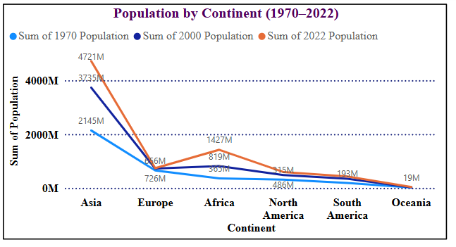
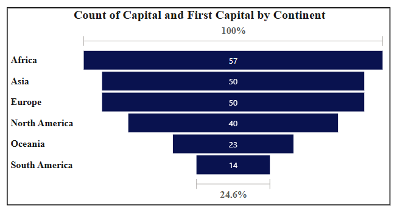
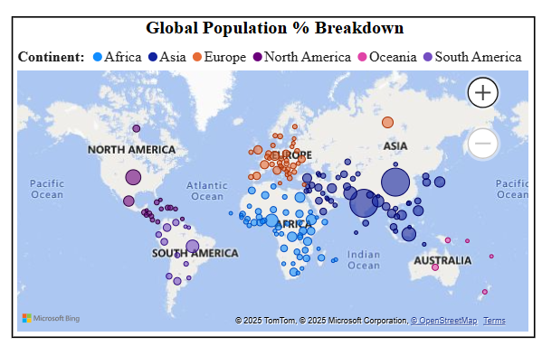
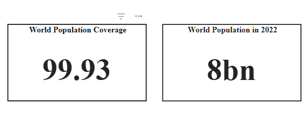
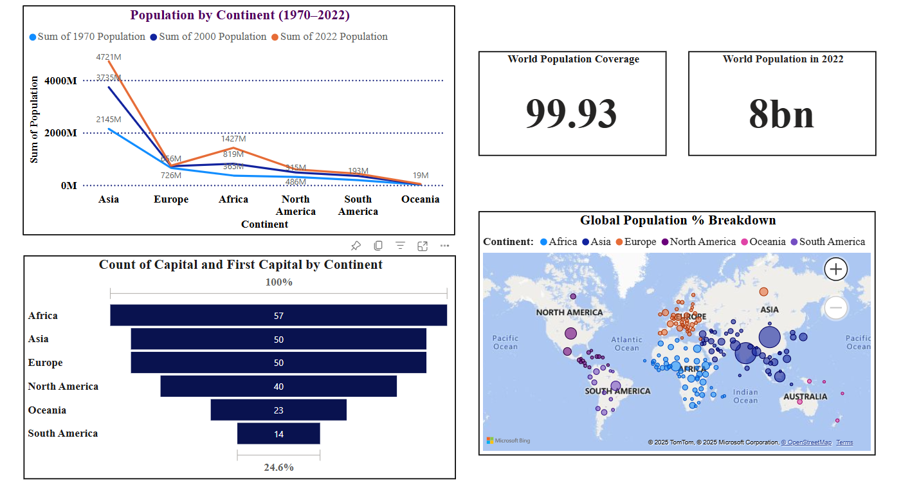

# 📊 Population Census (1970–2022) Data Analysis Project

This project provides a visual and analytical overview of global population growth and capital city distribution from 1970 to 2022 using **Power BI** and **Python (Google Colab)**. It highlights how population has shifted across continents over the decades and analyzes the count of capitals per continent.

---

## 📂 Project Structure

```bash
Population-Census-Analysis/
├── Population Census(1970 - 2022).pbix     # Power BI dashboard file
├── PowerBI_1.ipynb                         # Python notebook to check data quality
├── world_population.csv                    # Clean dataset with population & capital info
├── README.md                               # Project documentation
├── Screenshots/                            # Dashboard screenshots
│   ├── dashboard-preview.png
│   ├── population-trend.png
│   ├── capital-distribution.png
│   ├── geo-map-visual.png
│   ├── population-cards.png                
```

---

## 📌 Dashboard Highlights

- 🌍 Population distribution by **continent** and **year** (1970, 2000, 2022)
- 📈 Interactive visuals for population trends over time
- 📊 Capital count by continent
- 🗺️ Geo-map showing population % breakdown worldwide
- 📦 No missing or duplicate values – clean data used directly

---

## 🧰 Tools Used

- ✅ Power BI (for visual storytelling)
- ✅ Google Colab (for data verification using Python)
- ✅ CSV Dataset (world population with year & continent)

---

## 🖼️ Dashboard Previews

Visual insights captured from the Power BI report:






> 🔍 Full Dashboard Overview  



---

## 🔎 How to Use

1. **Download** this repository
2. Open the `.pbix` file using **Power BI Desktop**
3. Use slicers and filters to interact with the visualizations
4. Use the `.ipynb` notebook in **Colab** for simple data exploration

---


## 📬 Connect

Feel free to explore, star ⭐, or fork the repo.  
Authored by **[Telidevara S V S Kanaka Mahalakshmi](https://github.com/Mahalakshmi-Telidevara)**

---

